# JSON Configuration System Architecture

## Overview

The Stillwater System Simulator uses a hierarchical JSON-based configuration system to define heterogeneous computing systems. This document provides UML diagrams and architectural overview of the configuration classes.

## High-Level Architecture

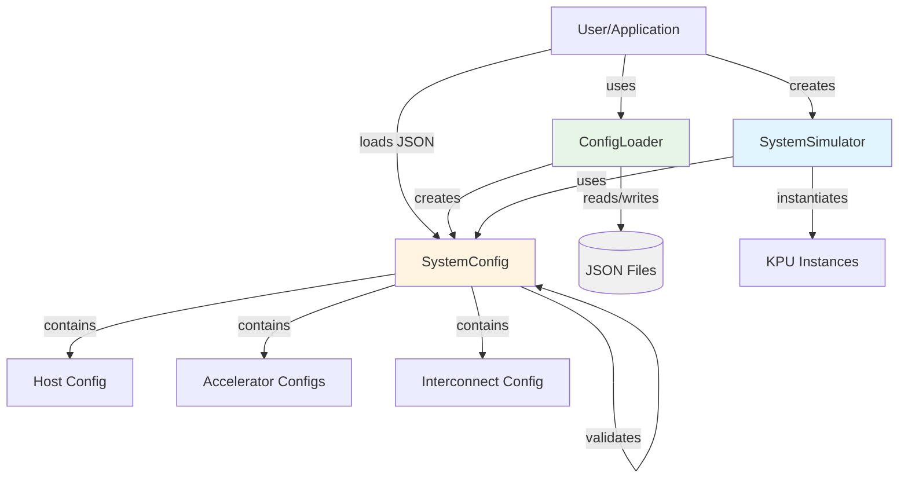

## Core Classes

### Main System Classes

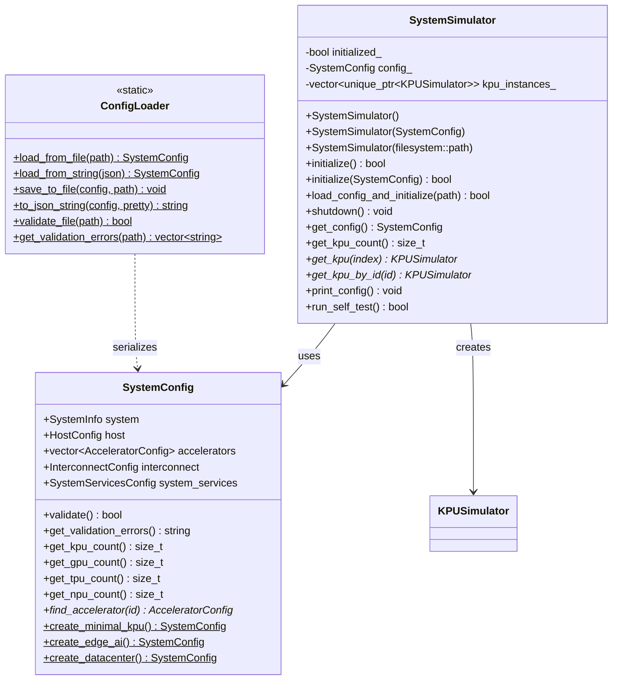

## Configuration Hierarchy

### System Configuration Structure

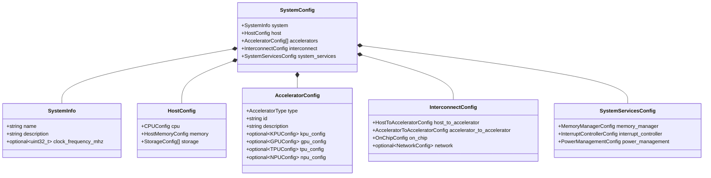

### Host Configuration

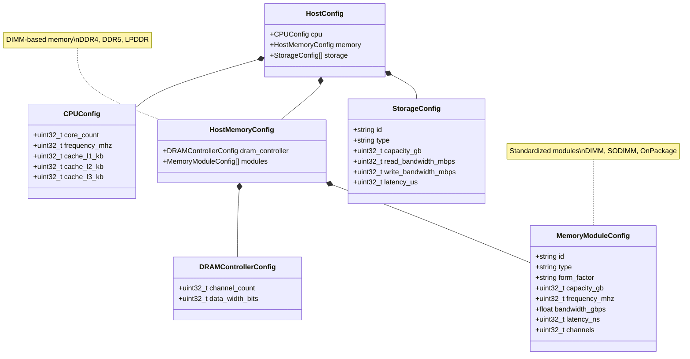

### Accelerator Configuration

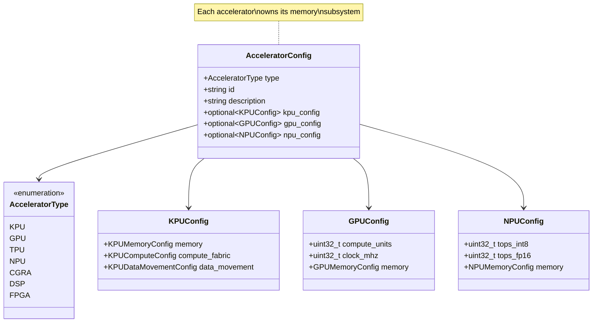

### KPU Configuration Details

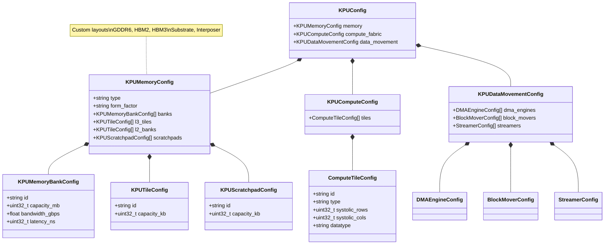

### Interconnect Configuration

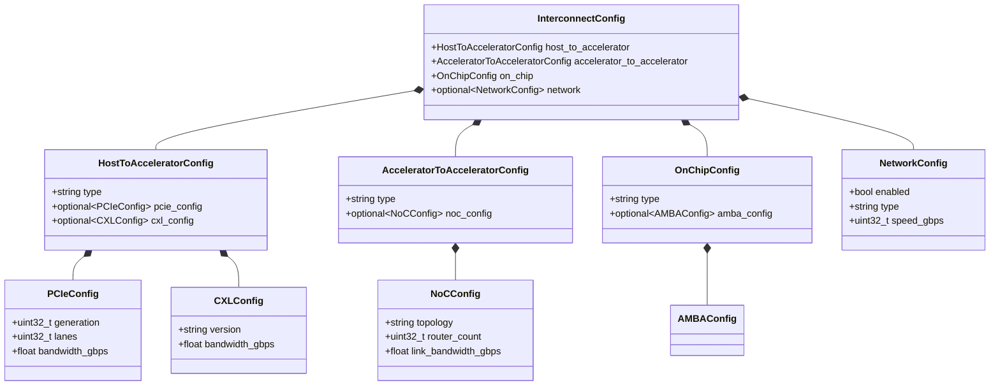

## Memory Architecture

### Memory Subsystem Ownership

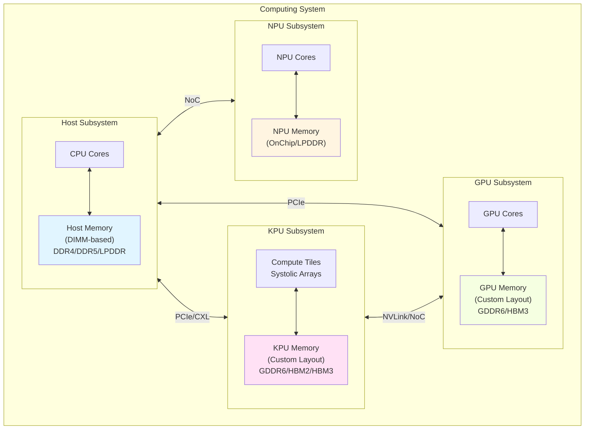

## Configuration Workflows

### JSON File Loading

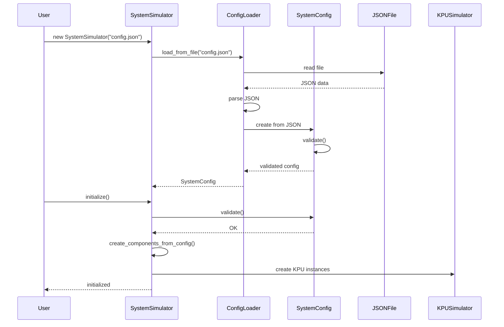

### Programmatic Configuration

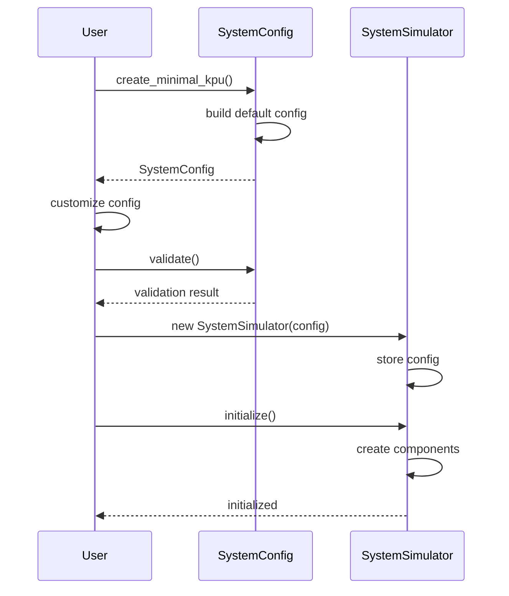

### Configuration Round-Trip

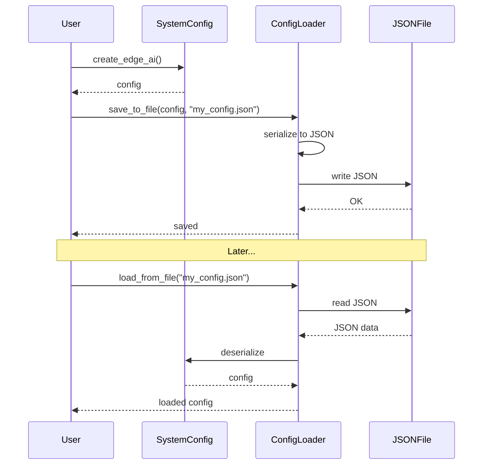

## Validation Rules

The configuration system enforces several validation rules:

1. **Required Fields**
   - System name must be non-empty
   - At least one host memory module required

2. **Component Constraints**
   - KPU must have at least one memory bank
   - KPU must have at least one compute tile
   - Scratchpad count ≥ compute tile count (recommended)
   - DMA engine count ≤ memory bank count × 2

3. **Interconnect Consistency**
   - Multi-accelerator systems should define accelerator-to-accelerator interconnect
   - Interconnect bandwidth should not create obvious bottlenecks

4. **Memory Technology Constraints**
   - Host: DDR/LPDDR only (DIMM-based)
   - KPU/GPU: GDDR/HBM (custom layouts)
   - NPU: OnChip/LPDDR (power-efficient)

## Example Configurations

### Minimal KPU System

```json
{
  "system": { "name": "Minimal KPU System" },
  "host": {
    "cpu": { "core_count": 4, "frequency_mhz": 2400 },
    "memory": {
      "modules": [
        { "id": "mem_0", "type": "DDR4", "capacity_gb": 16 }
      ]
    }
  },
  "accelerators": [
    {
      "type": "KPU",
      "id": "kpu_0",
      "kpu_config": {
        "memory": {
          "type": "GDDR6",
          "banks": [
            { "id": "bank_0", "capacity_mb": 1024, "bandwidth_gbps": 100 }
          ],
          "scratchpads": [
            { "id": "scratch_0", "capacity_kb": 64 }
          ]
        },
        "compute_fabric": {
          "tiles": [
            { "id": "tile_0", "systolic_rows": 16, "systolic_cols": 16 }
          ]
        }
      }
    }
  ]
}
```

### Edge AI System (Multi-Accelerator)

- KPU with LPDDR5 (power-efficient)
- NPU for CNN inference
- NoC interconnect between accelerators

### Datacenter System (High-End)

- KPU with HBM3 (ultra-high bandwidth)
- GPU with HBM3
- PCIe Gen5 host interconnect
- NVLink accelerator-to-accelerator

## File Structure

```
KPU-simulator/
├── configs/
│   ├── schema.md                    # JSON schema reference
│   ├── README.md                    # User guide
│   └── examples/
│       ├── minimal_kpu.json         # Basic configuration
│       ├── edge_ai.json             # Edge device
│       └── datacenter_hbm.json      # Datacenter node
├── include/sw/system/
│   ├── system_config.hpp            # Configuration structures
│   ├── config_loader.hpp            # JSON I/O
│   └── toplevel.hpp                 # System simulator
├── src/system/
│   ├── system_config.cpp            # Config implementation
│   ├── config_loader.cpp            # JSON parsing
│   └── toplevel.cpp                 # Simulator implementation
├── tests/system/
│   └── test_system_config.cpp       # Configuration tests
└── examples/basic/
    └── system_config_demo.cpp       # Usage examples
```

## Key Design Decisions

1. **Memory Subsystem Separation**
   - Each accelerator owns its memory subsystem
   - Reflects real hardware architecture (DIMMs vs custom layouts)

2. **Hierarchical Composition**
   - Tree structure mirrors physical system organization
   - Easy to navigate and understand

3. **Type-Safe Configuration**
   - Strong typing with enums and structs
   - Compile-time type checking

4. **Validation First**
   - All configs validated before use
   - Clear error messages for debugging

5. **Multiple Workflows**
   - JSON files for reproducibility
   - Factory methods for quick start
   - Programmatic for dynamic generation

## References

- [Configuration User Guide](../configs/README.md)
- [JSON Schema Reference](../configs/schema.md)
- [Example Configurations](../configs/examples/)
- [Implementation Guide](json-configuration-system.md)
