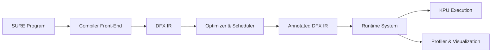
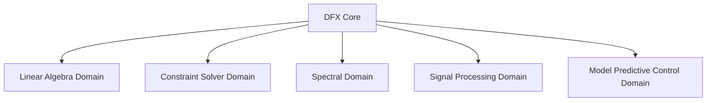
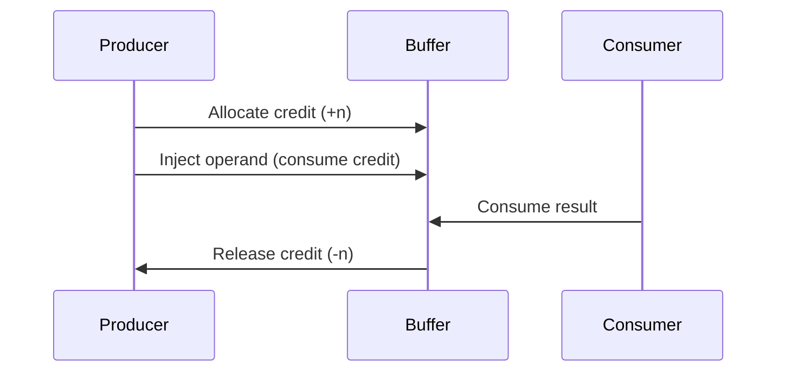
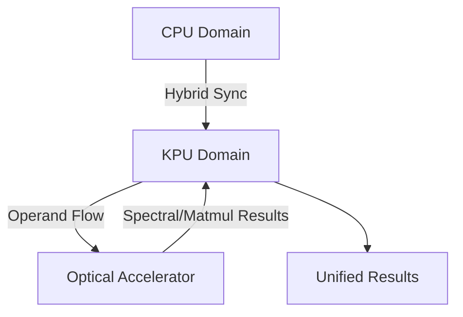
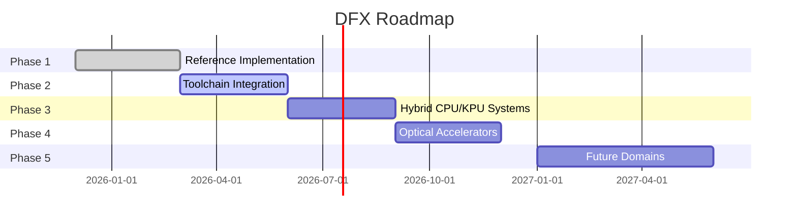

# DFX Diagrams

### 1. Toolchain Integration Flow

*Shows the full pipeline from source → IR → optimization → runtime → profiling.*

---

### 2. Computational Domains

*Highlights the five computational domains supported by DFX.*

---

### 3. Buffer Credit Flow Control

*Illustrates how credits are allocated, consumed, and released to enforce flow control.*

---

### 4. Hybrid CPU/KPU/Optical Integration

*Shows hybrid execution across CPU, KPU, and optical accelerators with synchronization.*

---

### 5. Roadmap Timeline

*Visualizes the phased roadmap for DFX development.*

