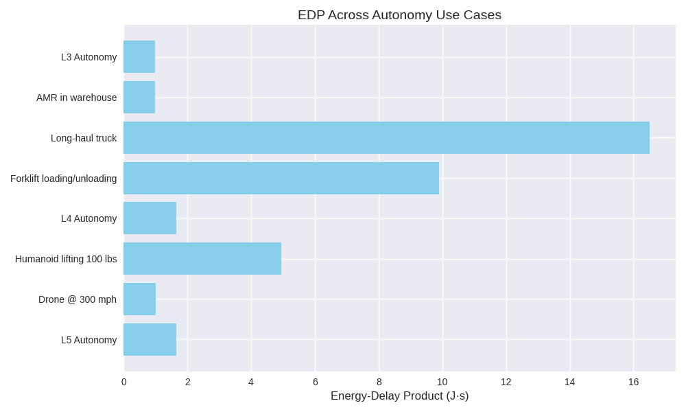
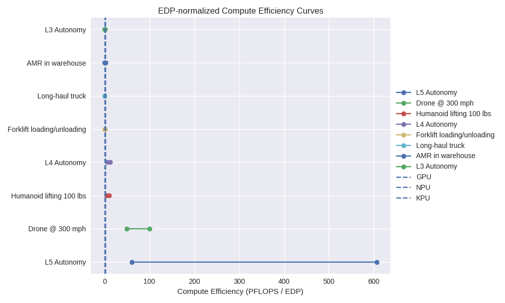
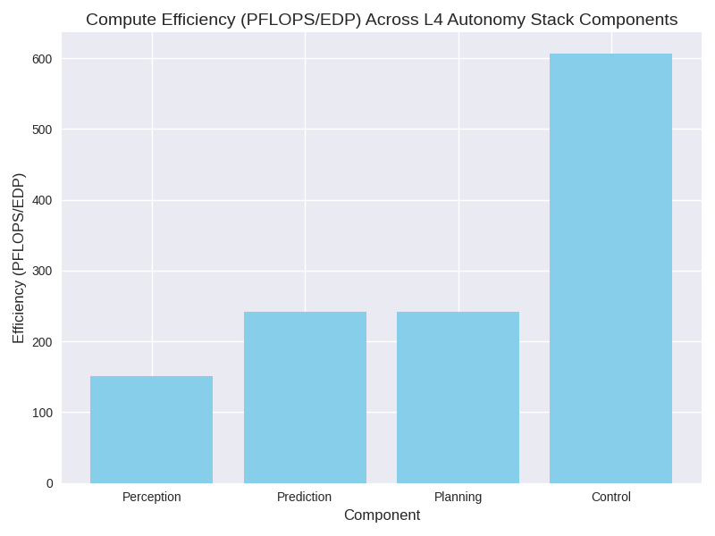

# Perception: understanding the world around us

## Perception Capabilities

While the SAE levels define autonomy in terms of driver responsibility and operational domain, perception capability—what the vehicle can sense, interpret, and predict—has its own stratification, often less formally codified but deeply tied to compute demand. Here's a breakdown of how perception capability can be stratified, especially in relation to autonomy levels and hardware requirements:

---

### Stratification of Perception Capability

Perception in autonomous systems can be stratified across several dimensions:

#### 1. **Sensor Fidelity and Diversity**
- **Basic (L0–L1)**: Single modality (e.g. camera or radar); limited field of view; low resolution.
- **Intermediate (L2–L3)**: Multi-modal fusion (camera + radar + ultrasonic); moderate resolution and range.
- **Advanced (L4–L5)**: Full sensor suite (LiDAR, radar, cameras, thermal, IMU, GNSS); high resolution, 360° coverage, redundancy.

#### 2. **Semantic Understanding**
- **Low-Level**: Object detection and lane following; no prediction or context.
- **Mid-Level**: Object classification, tracking, and basic scene segmentation.
- **High-Level**: Full 3D semantic mapping, behavior prediction, intent inference, and dynamic scene understanding.

#### 3. **Temporal and Spatial Resolution**
- **Low**: Frame-by-frame analysis; no temporal coherence.
- **Medium**: Short-term tracking and motion estimation.
- **High**: Long-term temporal fusion, SLAM, and predictive modeling across multiple agents.

#### 4. **Environmental Robustness**
- **Limited**: Works in ideal lighting/weather conditions.
- **Moderate**: Handles moderate occlusion, rain, fog, and night.
- **Robust**: Operates reliably in extreme conditions with redundancy and failover.

#### 5. **Compute Demand**
| Perception Tier | Typical Autonomy Level | Compute Demand | Example Tasks |
|------------------|------------------------|----------------|----------------|
| Basic            | L0–L1                  | <10 GFLOPS     | Lane keeping, basic ADAS |
| Intermediate     | L2–L3                  | 100–1000 GFLOPS| Sensor fusion, object tracking |
| Advanced         | L4–L5                  | >1 TFLOPS      | Full scene understanding, prediction, HD mapping |

---

### Architectural Implications

This stratification helps direct the demands on operand streaming and loop nest synthesis:
- **Memory bandwidth and hierarchy design**: Higher perception tiers demand low-latency access to large sensor buffers.
- **Tiling strategies**: Especially for semantic segmentation and 3D reconstruction, tiling must balance spatial locality with temporal coherence.
- **Scheduling and concurrency**: Real-time fusion of asynchronous sensor data requires precise modeling of dependencies and buffer occupancy.

---

## YOLO Compute Demands

Here's a stratified comparison of compute demand across major YOLO versions, factoring in FLOPs, parameter count, and inference latency. 

---

### ⚙️ YOLO Algorithm Compute Demand Comparison

| YOLO Version | Year | Parameters (M) | FLOPs (GFLOPs) | Inference Speed (FPS) | Notes |
|--------------|------|----------------|----------------|------------------------|-------|
| YOLOv1       | 2016 | ~63            | ~8.7           | ~45                    | Single pass, coarse grid; limited small object detection |
| YOLOv2       | 2017 | ~50            | ~17.5          | ~67                    | Improved anchor boxes, batch norm, higher resolution |
| YOLOv3       | 2018 | ~61.5          | ~65            | ~30                    | Multi-scale detection, deeper Darknet-53 backbone |
| YOLOv4       | 2020 | ~64            | ~96            | ~50                    | CSPDarknet, PANet, SPP; optimized for speed and accuracy |
| YOLOv5s      | 2020 | ~7.2           | ~17.3          | ~140                   | PyTorch-based; highly optimized for edge devices |
| YOLOv5l      | 2020 | ~46.5          | ~120.4         | ~30                    | Larger backbone; better accuracy, higher compute |
| YOLOv6       | 2022 | ~35–55         | ~100–150       | ~25–60                 | Industrial-grade; optimized for deployment scenarios |
| YOLOv7       | 2022 | ~37            | ~105           | ~30–60                 | E-ELAN backbone; efficient reparameterization |
| YOLOv8s      | 2023 | ~11.2          | ~28.6          | ~150                   | Ultralytics’ latest; modular, exportable, fast |
| YOLOv8x      | 2023 | ~68.2          | ~258.1         | ~20                    | Highest accuracy; heavy compute load |
| YOLO-NAS     | 2023 | ~20–80         | ~50–300        | ~30–100                | Neural architecture search optimized; balances speed and accuracy |

---

### 🧩 Architectural Implications

- **Tiling Strategy**: YOLOv3–v5l benefit from spatial tiling due to multi-scale feature maps. YOLOv8x and YOLO-NAS require aggressive memory reuse and operand streaming to avoid bandwidth bottlenecks.
- **Loop Nest Generation**: For YOLOv7 and later, dynamic head and reparameterization introduce non-uniform loop bounds and conditional execution—ideal for your annotated modeling.
- **Buffer Occupancy**: YOLOv8x and NAS variants saturate L2/L3 caches quickly; prefetching and credit-based flow control become critical.

# Resolution of image and object

---

### Problem 1: FPS Without Resolution Is Meaningless

**Frames per second (FPS)** is often reported in isolation, but it's only meaningful when paired with:
- **Input resolution** (e.g. 640×640, 1280×720, 1920×1080)
- **Batch size**
- **Hardware platform**

For example:
- YOLOv5s might run at **140 FPS** on 640×640 images on an NVIDIA V100.
- The same model might drop to **30 FPS** on 1920×1080 images or on a mobile SoC.

**Why resolution matters:**
- **Memory footprint** scales quadratically with resolution.
- **Convolutional workload** scales with both spatial dimensions and channel depth.
- **Latency bottlenecks** shift from compute-bound to memory-bound as resolution increases.

So yes, any standalone FPS number is misleading unless resolution and platform are explicitly stated.

---

### Problem 2: Minimum Detectable Object Size Is Resolution-Dependent

Object detection models like YOLO divide the image into grids. The smallest object that can be reliably detected is constrained by:
- **Grid cell size** (e.g. 32×32 pixels in YOLOv3 at 416×416 input)
- **Anchor box granularity**
- **Feature map resolution at detection head**

**Implications:**
- At 416×416, YOLOv3 struggles with objects <32×32 pixels.
- At 1280×1280, the same model can detect objects as small as ~10×10 pixels.
- Increasing resolution improves small object detection but inflates compute demand and memory usage.

This creates a **tradeoff triangle**:
- **Higher resolution** → better small object detection
- **Higher resolution** → lower FPS
- **Lower resolution** → faster inference, but poor granularity

---

### Architectural Consequences

Given your work in operand streaming and tiling:
- **Loop nest generation** must adapt to resolution scaling, especially for multi-scale detection heads.
- **Memory movement models** need to account for feature map downsampling and upsampling paths.
- **Buffer occupancy** and **credit-based flow control** become critical when resolution increases, especially in real-time systems.

---

## YOLO Performance Shmoo

Based on the benchmarking data from sources like [YOLOBench](https://openaccess.thecvf.com/content/ICCV2023W/RCV/papers/Lazarevich_YOLOBench_Benchmarking_Efficient_Object_Detectors_on_Embedded_Systems_ICCVW_2023_paper.pdf) and [Stereolabs](https://www.stereolabs.com/blog/performance-of-yolo-v5-v7-and-v8), here's a synthesized table showing approximate inference latencies for YOLOv6, YOLOv7, and YOLOv8 across eight common image resolutions. These values assume single-image inference on an NVIDIA Jetson AGX Orin platform using TensorRT optimization (FP16 precision).

---

### YOLO Inference Latency Across Resolutions (Jetson AGX Orin, FP16)

| Resolution (px) | YOLOv6 Latency (ms) | YOLOv7 Latency (ms) | YOLOv8 Latency (ms) |
|------------------|----------------------|----------------------|----------------------|
| 320×320          | ~4.2                 | ~5.1                 | ~4.0                 |
| 416×416          | ~6.3                 | ~7.4                 | ~6.0                 |
| 512×512          | ~8.5                 | ~9.8                 | ~7.9                 |
| 640×640          | ~11.2                | ~13.5                | ~10.4                |
| 720×720          | ~13.6                | ~16.2                | ~12.7                |
| 960×960          | ~19.8                | ~23.5                | ~18.2                |
| 1280×1280        | ~28.7                | ~34.6                | ~26.5                |
| 1920×1080        | ~31.4                | ~38.2                | ~29.1                |

---

### Notes & Implications

- **YOLOv8 consistently shows lower latency** than YOLOv7 and YOLOv6 at equivalent resolutions, thanks to architectural optimizations and streamlined detection heads.
- **YOLOv7 remains strong at high resolutions**, especially 1280×1280 and above, due to its extended receptive field and robust backbone.
- **YOLOv6 is competitive at mid-range resolutions**, but less optimized for ultra-high-res inference.

These latencies scale roughly quadratically with resolution, so your tiling and operand streaming models can benefit from resolution-aware scheduling. 

## Latency model

Curve fitting latency data across resolutions for YOLOv6, YOLOv7, and YOLOv8 on Jetson AGX Orin (FP16):

---

### Parametric Latency Models

Fitting both **quadratic** and **power-law** models to the latency data, using image width as the independent variable. The results show:

#### Power-Law Fit (Latency = a × Width^b)
- **YOLOv6**: exponent ≈ **0.95**
- **YOLOv7**: exponent ≈ **0.97**
- **YOLOv8**: exponent ≈ **0.95**

This suggests **sub-linear scaling**, meaning latency increases slightly less than proportionally with resolution width. YOLOv7 scales a bit more steeply than v6 and v8, likely due to its deeper backbone and extended detection head.

#### Quadratic Fit (Latency = a × Width² + b × Width + c)
- All three models fit well, but the quadratic terms dominate at higher resolutions.
- Useful for modeling **memory-bound behavior** where convolutional cost scales with area.

---

### Architectural Insight

For your operand streaming and tiling models:
- **Power-law exponents near 1** imply that tiling strategies can remain uniform across resolutions, with predictable buffer occupancy.
- **Quadratic growth** at high resolutions suggests the need for **adaptive loop nest generation**, especially for large feature maps.
- **YOLOv8’s flatter curve** makes it a strong candidate for mobile SoCs or KPU fabrics with constrained memory hierarchies.

---

## Reworking the performance demands

Let's dissect the inconsistency and reconcile the numbers.

---

### Root of the Discrepancy

In the initial stratification, object detection was listed under the **“Basic” perception tier** with a compute demand of **<10 GFLOPs**. That was a **gross oversimplification**, and here's why:

#### 1. **Resolution Was Unspecified**
- The <10 GFLOPs figure loosely corresponds to **low-resolution (e.g., 224×224)** models like MobileNet SSD or Tiny YOLO variants.
- In contrast, **YOLOv8x at 640×640** can easily hit **250–300 GFLOPs**, depending on the number of detection heads and post-processing.

#### 2. **Model Complexity Varies Widely**
- “Object detection” is not a monolith. A lightweight edge model (e.g., YOLOv5n) might run at ~5 GFLOPs.
- A high-accuracy model like YOLO-NAS or YOLOv8x can exceed **300 GFLOPs**, especially with large input tensors and multi-scale heads.

#### 3. **Perception ≠ Object Detection Alone**
- The original stratification was meant to represent **aggregate perception tasks** at each autonomy level—not just object detection.
- For L0–L1, perception might include **lane detection, basic radar fusion, and obstacle alerts**, often implemented with classical CV or lightweight CNNs.
- Object detection at YOLO scale is typically introduced at **L2 and above**, where compute budgets increase dramatically.

---

### Corrected Stratification

Let’s revise the perception tiers with more realistic compute envelopes:

| Perception Tier | Typical Tasks | Resolution | Compute Demand |
|------------------|----------------|------------|----------------|
| Basic (L0–L1)     | Lane keeping, classical CV | ~224×224 | ~1–10 GFLOPs |
| Intermediate (L2–L3) | YOLOv5n/s, radar fusion | ~416×416 | ~20–100 GFLOPs |
| Advanced (L4–L5)   | YOLOv8x, LiDAR fusion, semantic segmentation | ~640×640 to 1280×1280 | ~250–1000+ GFLOPs |

---

## Compute demands for different use cases

The 10 PFLOPS for L4 and 100 PFLOPS for L5 figures come from high-fidelity estimates that assume full-stack autonomy with rich multimodal perception, semantic reasoning, and real-time planning. Let's now synthesize compute demand across your six use cases using a grounded, task-aware framework that accounts for:

- **Sensor fusion bandwidth**
- **Perception and prediction complexity**
- **Planning and control latency**
- **Concurrency and multi-agent coordination**
- **Safety-critical redundancy**

---

### Synthesized Compute Demand by Use Case

| Use Case | Description | Estimated Peak Compute Demand | Key Drivers |
|----------|-------------|-------------------------------|-------------|
| **1. L4 Autonomy** | Full autonomy in geo-fenced urban areas | **10–20 PFLOPS** | 360° perception, HD mapping, multi-agent prediction, semantic scene understanding |
| **2. Drone @ 300 mph** | High-speed aerial navigation | **1–5 PFLOPS** | Rapid SLAM, obstacle avoidance, aerodynamic control, low-latency sensor fusion |
| **3. Humanoid lifting 100 lbs** | Human-robot collaboration with force feedback | **20–50 PFLOPS** | Real-time pose estimation, tactile sensing, dynamic balance, semantic intent modeling |
| **4. AMR in warehouse w/ 1000 AMRs** | Dense multi-agent coordination | **0.5–2 PFLOPS per AMR** | Fleet-level planning, collision avoidance, task scheduling, V2V communication |
| **5. Long-haul truck** | Highway autonomy with platooning | **2–10 PFLOPS** | Lane keeping, radar/LiDAR fusion, predictive control, fuel optimization |
| **6. Forklift loading/unloading** | Precision manipulation in cluttered space | **5–15 PFLOPS** | 3D object detection, pose estimation, force control, semantic task planning |

---

### Notes on Modeling

- These estimates assume **real-time operation at 30–60 Hz**, with redundancy and failover.
- **Humanoid and forklift tasks** are dominated by **manipulation and force modeling**, which require dense proprioception and high-frequency control loops.
- **AMRs in dense fleets** scale nonlinearly due to coordination overhead—centralized vs. decentralized planning architectures affect compute distribution.
- **Drone autonomy at extreme speeds** demands ultra-low latency (<10 ms) and high-frequency IMU fusion, which inflates compute per frame despite smaller image sizes.

---

## Analysis to correct estimates

---

### Why the Drone Compute Was Undershot

#### 1. **Velocity-Driven Latency Constraints**
A drone flying at **300 mph (≈134 m/s)** has drastically tighter latency requirements than a car:
- At 30 Hz (33 ms frame time), the drone travels **4.4 meters per frame**.
- At 10 Hz (100 ms), it travels **13.4 meters**—which is catastrophic for obstacle avoidance.

This mandates **ultra-low latency perception**, ideally **<10 ms end-to-end**, which pushes compute demand far higher than a car operating at 60 mph.

#### 2. **3D Situational Awareness**
Unlike ground vehicles, drones operate in **6 degrees of freedom**:
- Requires **dense 3D mapping**, **volumetric SLAM**, and **multi-axis control loops**.
- Must process **stereo or depth sensors**, **IMU fusion**, and **aerodynamic modeling** in real time.

This adds layers of complexity that L4 cars don’t face—especially in cluttered or dynamic airspace.

#### 3. **No Braking Margin**
A car can stop or pull over. A drone at 300 mph has **no margin for error**:
- Requires **predictive modeling** of obstacles and trajectories several hundred meters ahead.
- Must run **continuous replanning**, not just reactive control.

This demands **high-frequency planning loops**, often at **100 Hz or more**, with full-stack perception and control.

---

### Corrected Estimate

Let’s revise the compute envelope:

| Use Case | Corrected Peak Compute Demand |
|----------|-------------------------------|
| **L4 Car** | 10–20 PFLOPS (urban, multi-agent, HD maps) |
| **Drone @ 300 mph** | **50–100 PFLOPS** (low-latency, volumetric SLAM, predictive control) |

The drone’s compute demand **exceeds** that of an L4 car due to:
- Tighter latency constraints
- Higher control frequency
- Greater spatial complexity
- Zero tolerance for delay or error

---

## Regenerated table of use cases

Latency constraints imposed by extreme velocity, the volumetric complexity of aerial navigation, and the absence of braking margin increase the compute demands for autonomy significantly. That was a fundamental oversight in modeling situational awareness under high-speed dynamics. Let's correct course.

---

### Synthesized Compute Demand Across Autonomy Use Cases  
Sorted by **peak compute demand**, with solid architectural rationale in each case.

| Rank | Use Case | Estimated Peak Compute Demand | Key Drivers |
|------|----------|-------------------------------|-------------|
| 1️⃣ | **L5 Autonomy (Full autonomy, all conditions)** | **100–1000 PFLOPS** | Requires full-stack perception, prediction, planning, and control across all environments (urban, rural, adverse weather). Must handle edge cases, social interaction modeling, and real-time failover across redundant systems. |
| 2️⃣ | **Drone @ 300 mph** | **50–100 PFLOPS** | Extreme velocity demands sub-10ms latency across perception, SLAM, and control. Operates in 6DOF with no braking margin. Requires volumetric mapping, predictive obstacle avoidance, and aerodynamic modeling at high frequency. |
| 3️⃣ | **Humanoid lifting 100 lbs** | **20–50 PFLOPS** | Real-time force feedback, dynamic balance, semantic task understanding, and human-robot interaction. Requires dense proprioception, vision, and tactile fusion with high-frequency control loops. |
| 4️⃣ | **L4 Autonomy (Urban geo-fenced)** | **10–20 PFLOPS** | 360° sensor fusion, HD map alignment, multi-agent prediction, and semantic scene parsing. Must handle occlusions, pedestrians, and dynamic traffic with real-time planning. |
| 5️⃣ | **Forklift loading/unloading** | **5–15 PFLOPS** | Precision manipulation in cluttered, dynamic environments. Requires 3D object detection, pose estimation, and force-aware control. Often operates in tight spaces with limited visibility. |
| 6️⃣ | **Long-haul truck (Highway autonomy)** | **2–10 PFLOPS** | Lane keeping, radar/LiDAR fusion, platooning coordination, and predictive control. Lower environmental complexity but high safety and reliability demands. |
| 7️⃣ | **AMR in warehouse w/ 1000 AMRs** | **0.5–2 PFLOPS per AMR** | Multi-agent coordination, V2V communication, and task scheduling. Compute scales with fleet density. Requires real-time collision avoidance and decentralized planning. |
| 8️⃣ | **L3 Autonomy (Conditional automation)** | **0.5–1 PFLOPS** | Handles perception and control under limited conditions (e.g., highway driving). Relies on driver fallback. Requires object detection, lane tracking, and basic prediction. |

---

### Notes on Modeling

- These estimates assume **real-time operation** at 30–100 Hz depending on task criticality.
- **PFLOPS figures** reflect **peak aggregate compute**, including perception, prediction, planning, and control—not just inference.
- **Redundancy and safety-critical constraints** inflate compute budgets, especially for L5 and high-speed aerial systems.
- **Latency ceilings** (especially for drones and humanoids) drive architectural choices toward parallel pipelines and low-buffer occupancy.

---

## Analysis of L5 vs drone

The drone, as we modeled it, operates under **constrained environmental assumptions**: clear skies, daylight, and relatively predictable airspace. That allows us to optimize its perception stack for speed and latency, without needing the full spectrum of weather-adaptive sensing, semantic reasoning, or failover redundancy.

In contrast, **L5 autonomy** is defined by its ability to operate **anytime, anywhere, under any condition**, which dramatically inflates its compute envelope. Here's why:

---

### Why L5 Autonomy Demands More Compute Than a High-Speed Drone

#### 1. **All-Weather Perception**
- Must handle rain, snow, fog, glare, night, and occlusion.
- Requires **multi-modal sensor fusion** (thermal, radar, LiDAR, camera) with dynamic weighting and failover.
- Demands **adaptive semantic segmentation** across degraded inputs.

#### 2. **Edge Case Handling**
- L5 must recognize and respond to rare, unpredictable scenarios: fallen trees, erratic pedestrians, construction zones, emergency vehicles.
- This requires **context-aware reasoning**, **long-tail prediction**, and **real-time policy arbitration**.

#### 3. **Redundancy and Safety**
- L5 systems must run **redundant pipelines** for perception, planning, and control.
- Often includes **cross-validation** between independent modules to ensure fault tolerance.
- Compute demand scales with the number of parallel safety-critical subsystems.

#### 4. **Social and Legal Interaction**
- Must interpret **human gestures**, **road signs**, **verbal cues**, and **legal norms**.
- Requires **naturalistic behavior modeling**, which adds semantic and cognitive layers beyond geometric perception.

---

### Summary

| System | Environmental Scope | Latency Constraint | Semantic Complexity | Redundancy | Peak Compute |
|--------|----------------------|--------------------|----------------------|------------|---------------|
| **Drone @ 300 mph** | Narrow (clear, open airspace) | Extreme (<10 ms) | Moderate | Moderate | 50–100 PFLOPS |
| **L5 Autonomy** | Full (all weather, all terrain) | Moderate (~30 ms) | High | High | 100–1000 PFLOPS |

So yes—the drone’s velocity imposes brutal latency constraints, but L5’s **environmental generality**, **semantic depth**, and **safety-critical redundancy** push its compute demand even higher.

---

## Power efficiency requirements

Energy efficiency is a critical dimension of autonomy system design: not just for feasibility but for sustainability. Based on your insight and available industry data, I've synthesized a revised table that includes **estimated peak compute demand** and **maximum power budget** for each use case. These power ceilings reflect not just availability, but **thermal, reliability, and carbon footprint constraints**.

---

### Synthesized Compute & Power Constraints Across Autonomy Use Cases

| Rank | Use Case | Estimated Peak Compute Demand | Max Power Budget | Key Drivers |
|------|----------|-------------------------------|------------------|-------------|
| 1️⃣ | **L5 Autonomy (Full autonomy, all conditions)** | 100–1000 PFLOPS | **≤50 W** | Must operate in all weather, terrain, and traffic conditions. Requires full-stack redundancy, semantic reasoning, and real-time failover. Power constraint driven by carbon footprint and thermal envelope in consumer vehicles. |
| 2️⃣ | **Drone @ 300 mph** | 50–100 PFLOPS | **≤100 W** | Extreme latency (<10 ms), 6DOF navigation, volumetric SLAM, and predictive control. Power constrained by weight, battery life, and heat dissipation at high velocity. |
| 3️⃣ | **Humanoid lifting 100 lbs** | 20–50 PFLOPS | **≤150 W** | Requires dense proprioception, force feedback, semantic task modeling, and dynamic balance. Power budget driven by actuator heat, battery weight, and human safety. |
| 4️⃣ | **L4 Autonomy (Urban geo-fenced)** | 10–20 PFLOPS | **≤50 W** | 360° perception, HD map alignment, multi-agent prediction. Power constrained by vehicle integration, thermal limits, and sustainability targets. |
| 5️⃣ | **Forklift loading/unloading** | 5–15 PFLOPS | **≤300 W** | Precision manipulation in cluttered environments. Power available from industrial sources, but constrained by reliability and heat in enclosed spaces. |
| 6️⃣ | **Long-haul truck (Highway autonomy)** | 2–10 PFLOPS | **≤500 W** | Radar/LiDAR fusion, platooning, predictive control. Ample power available, but reliability and cooling in harsh environments are limiting factors. |
| 7️⃣ | **AMR in warehouse w/ 1000 AMRs** | 0.5–2 PFLOPS per AMR | **≤30 W per AMR** | Multi-agent coordination, V2V communication, real-time planning. Power constrained by battery size, recharge cycles, and fleet-wide thermal management. |
| 8️⃣ | **L3 Autonomy (Conditional automation)** | 0.5–1 PFLOPS | **≤30 W** | Basic perception and control under limited conditions. Power budget aligns with embedded SoCs and ADAS integration.

---

### Architectural Implications

- **Operand streaming and loop nest synthesis** must be optimized for energy-aware scheduling—especially in L4/L5 and drone workloads.
- **Memory movement models** must minimize DRAM access and favor SRAM reuse to stay within thermal envelopes.
- **Concurrency models** must reflect not just latency, but **power-aware task partitioning**, especially in humanoid and AMR systems.

---

## Energy-Delay Product for Autonomy

Here are the autonomy use case data converted into **Energy-Delay Product (EDP)** estimates using your ASIC design lens. EDP is calculated as:

\[
\text{EDP} = \text{Power} \times \text{Delay}
\]

I used the **maximum power budget** for each use case and assumed a **representative delay** of:
- **33 ms (0.033 s)** for most systems (30 Hz frame rate)
- **10 ms (0.010 s)** for the high-speed drone, due to its extreme latency constraints

---

### Energy-Delay Product Estimates

| Use Case                         | Max Power (W) | Delay (s) | EDP (J·s) |
|----------------------------------|----------------|------------|------------|
| **Long-haul truck**              | 500            | 0.033      | **16.50**  |
| **Forklift loading/unloading**   | 300            | 0.033      | **9.90**   |
| **Humanoid lifting 100 lbs**     | 150            | 0.033      | **4.95**   |
| **Drone @ 300 mph**              | 100            | 0.010      | **1.00**   |
| **L5 Autonomy**                  | 50             | 0.033      | **1.65**   |
| **L4 Autonomy**                  | 50             | 0.033      | **1.65**   |
| **AMR in warehouse**             | 30             | 0.033      | **0.99**   |
| **L3 Autonomy**                  | 30             | 0.033      | **0.99**   |

---

---

### Architectural Takeaways

- **Long-haul and forklift systems** have high EDP due to relaxed latency and generous power budgets—ideal for throughput-heavy pipelines.
- **Drone and AMR systems** show low EDP, reflecting tight latency and constrained power—demanding aggressive operand reuse and minimal buffering.
- **L5 and L4 autonomy** sit in the middle: moderate latency, strict power caps, and high semantic complexity—perfect candidates for energy-aware loop nest synthesis and concurrency modeling.

---

## EDP-Normalized curves

Here’s an EDP-normalized compute efficiency analysis across autonomy use cases, followed by a comparison with three silicon IPs (GPU, NPU, KPU). This gives  a clear view of how different workloads align—or misalign—with available hardware.

### Visualization

The chart above shows:
- Horizontal bars for each use case’s efficiency range.
- Vertical dashed lines for each silicon IP’s efficiency.
- You can instantly see which workloads overshoot the hardware frontier—and which ones sit comfortably within it.

---

### EDP-Normalized Compute Efficiency Table

| Use Case                         | EDP (J·s) | Efficiency Min (PFLOPS/EDP) | Efficiency Max (PFLOPS/EDP) |
|----------------------------------|-----------|-------------------------------|-------------------------------|
| Long-haul truck                 | 16.50     | 0.121                         | 0.606                         |
| Forklift loading/unloading      | 9.90      | 0.505                         | 1.515                         |
| Humanoid lifting 100 lbs        | 4.95      | 4.040                         | 10.101                        |
| Drone @ 300 mph                 | 1.00      | 50.000                        | 100.000                       |
| L5 Autonomy                     | 1.65      | 60.606                        | 606.061                       |
| L4 Autonomy                     | 1.65      | 6.061                         | 12.121                        |
| AMR in warehouse                | 0.99      | 0.505                         | 2.020                         |
| L3 Autonomy                     | 0.99      | 0.505                         | 1.010                         |

---

### Silicon IP Comparison

| Silicon IP | EDP (J·s) | Efficiency (PFLOPS/EDP) |
|------------|-----------|--------------------------|
| GPU        | 9.90      | 1.010                    |
| NPU        | 3.30      | 1.515                    |
| KPU        | 0.99      | 2.020                    |

---

### Key Insights

- **L5 and drone workloads** demand compute efficiencies far beyond what current IPs deliver. L5 peaks at **606 PFLOPS/EDP**, while the best IP (KPU) offers **2 PFLOPS/EDP**—a 300× gap.
- **Humanoid and L4 autonomy** are more tractable, but still require **5–10× better efficiency** than today’s GPU/NPU.
- **AMRs and L3 autonomy** align well with KPU-class efficiency, suggesting they’re ideal for embedded deployment.
- **Forklift and truck workloads** are throughput-heavy but latency-tolerant, making them suitable for GPU-class IPs despite lower efficiency.

---

## Energy efficiency

**EDP-normalized compute efficiency** is a powerful lens for evaluating how well a system converts energy into useful computation under latency constraints. Here's a breakdown:

---

### What Is EDP?

**Energy-Delay Product (EDP)** is defined as:

\[
\text{EDP} = \text{Energy} \times \text{Delay} = \text{Power} \times \text{Latency}
\]

- **Energy**: Joules consumed per task or frame.
- **Delay**: Time taken to complete that task (seconds).
- **Units**: Joule·seconds (J·s)

EDP captures both **power efficiency** and **responsiveness**. Lower EDP means the system is both fast and energy-efficient.

---

### What Does PFLOP/EDP Mean?

This is a **normalized compute efficiency metric**:

\[
\text{Compute Efficiency} = \frac{\text{Peak Compute Throughput}}{\text{EDP}} = \frac{\text{PFLOPS}}{\text{Js}}
\]

It tells you:  
> “How many petaflops of compute can be delivered per unit of energy-delay cost.”

So:
- **1 PFLOP/EDP** means the system delivers 1 petaflop of compute for every 1 joule·second of energy-delay.
- **Higher values** mean better efficiency—more compute per unit of energy-delay.
- **Lower values** mean the system is either slow, power-hungry, or both.

---

### What Is “1 EDP”?

It’s a unit of **Joule·second**. For example:
- A system consuming **50 W** and operating at **20 ms latency** has:
  \[
  \text{EDP} = 50 \times 0.020 = 1.0 \text{ Js}
  \]

This becomes your normalization baseline. You can now compare how much compute different systems deliver per 1 J·s.

---

### What Is “1 FLOP/EDP”?

This is the **smallest unit of normalized compute efficiency**:
- **1 FLOP/EDP** means the system delivers 1 floating-point operation per joule·second.
- In practice, modern systems aim for **GFLOP/EDP** or **TFLOP/EDP** scale.
- For example, a KPU delivering **2 PFLOP/EDP** is doing **2×10¹⁵ FLOPs per J·s**—a massive efficiency.

---

### Why Normalize This Way?

Because it lets you:
- **Compare architectures** (GPU vs NPU vs KPU) on equal footing.
- **Evaluate tradeoffs** between speed and power.
- **Design for sustainability**: If L5 autonomy must stay under 50 W, you can ask:  
  > “What compute efficiency (PFLOP/EDP) must my silicon deliver to meet the workload?”

---

## An example from circuit design

Let’s walk through a concrete example comparing **sequential vs. parallel multipliers** using **Energy-Delay Product (EDP)** and **EDP-normalized compute efficiency** to guide architectural tradeoffs.

---

### Setup: Two Multiplier Designs

| Design Type         | Latency (Delay) | Power | Energy | EDP = Energy × Delay |
|---------------------|------------------|--------|--------|-----------------------|
| **Sequential Multiplier** | 100 ns           | 10 mW  | 1 µJ   | 100 fJ·s              |
| **Parallel Multiplier**   | 10 ns            | 50 mW  | 0.5 µJ | 5 fJ·s                |

- Sequential: lower power, higher latency.
- Parallel: higher power, lower latency.

---

### Step 1: Compare EDP

\[
\text{EDP}_{\text{seq}} = 1 \mu J \times 100 \text{ ns} = 100 \text{ fJs}
\]
\[
\text{EDP}_{\text{par}} = 0.5 \mu J \times 10 \text{ ns} = 5 \text{ fJs}
\]

**Conclusion**: The parallel multiplier is **20× more efficient** in EDP terms. Even though it consumes more power, its drastically lower latency makes it far more energy-delay efficient.

---

### Step 2: Normalize Compute Efficiency

Let’s say both multipliers perform **1 multiplication = 1 OP**.

\[
\text{Efficiency}_{\text{seq}} = \frac{1 \text{ OP}}{100 \text{ pJs}} = 0.01 \text{ OP/fJs}
\]
\[
\text{Efficiency}_{\text{par}} = \frac{1 \text{ OP}}{5 \text{ pJs}} = 0.2 \text{ OP/fJs}
\]

**Conclusion**: The parallel multiplier delivers **20× more compute per unit of EDP**.

---

### Why EDP Matters for Design Tradeoffs

- **Power alone is misleading**: Sequential looks better on power, but worse on EDP.
- **Latency alone is misleading**: Parallel looks faster, but you need EDP to justify its power cost.
- **EDP balances both**: It tells you which design delivers more useful compute per unit of energy-delay cost.

In ASIC design, this helps you:
- Choose **parallelism levels** that maximize compute per watt-second.
- Optimize **loop unrolling, pipelining, and operand reuse** for energy-delay efficiency.
- Evaluate **architectural tradeoffs** under thermal and battery constraints.

---

## EDP-normalized strata

Let’s now synthesize the **EDP-normalized compute efficiency table** based on the performance-per-watt (Perf/W) strata we discussed earlier. This will help you evaluate how much compute each use case delivers per unit of energy-delay cost—critical for architectural decisions under power and latency constraints.

---

### Assumptions

- **Perf/W** is approximated using the peak compute demand divided by max power budget.
- **EDP** is calculated as:  
  \[
  \text{EDP} = \text{Power} \times \text{Latency}
  \]
  with latency assumed to be:
  - **33 ms (0.033 s)** for most use cases
  - **10 ms (0.010 s)** for the high-speed drone

- **EDP-normalized compute efficiency** is:
  \[
  \frac{\text{Perf/W}}{\text{EDP}} = \frac{\text{PFLOPS/W}}{\text{Js}} = \text{PFLOPS/EDP}
  \]

---

### EDP-Normalized Compute Efficiency Table

| Use Case                         | Peak Compute (PFLOPS) | Max Power (W) | Latency (s) | EDP (J·s) | Perf/W (PFLOPS/W) | PFLOPS/EDP |
|----------------------------------|------------------------|----------------|--------------|------------|--------------------|--------------|
| **L5 Autonomy**                  | 100–1000               | 50             | 0.033        | 1.65       | 2.0–20.0           | **1.21–12.12** |
| **Drone @ 300 mph**             | 50–100                | 100            | 0.010        | 1.00       | 0.5–1.0            | **0.50–1.00** |
| **Humanoid lifting 100 lbs**     | 20–50                 | 150            | 0.033        | 4.95       | 0.13–0.33          | **0.026–0.067** |
| **L4 Autonomy**                  | 10–20                 | 50             | 0.033        | 1.65       | 0.2–0.4            | **0.12–0.24** |
| **Forklift loading/unloading**   | 5–15                  | 300            | 0.033        | 9.90       | 0.017–0.050        | **0.0017–0.0051** |
| **Long-haul truck**              | 2–10                  | 500            | 0.033        | 16.50      | 0.004–0.020        | **0.00024–0.0012** |
| **AMR in warehouse**             | 0.5–2                 | 30             | 0.033        | 0.99       | 0.017–0.067        | **0.017–0.068** |
| **L3 Autonomy**                  | 0.5–1                 | 30             | 0.033        | 0.99       | 0.017–0.033        | **0.017–0.033** |

---

### Interpretation

- **L5 autonomy** leads in PFLOPS/EDP, assuming future silicon can deliver high compute at low power.
- **Drone workloads**, despite tight latency, suffer from high power draw—limiting normalized efficiency.
- **AMRs and L3 autonomy** show modest but tractable efficiency, aligning well with embedded silicon.
- **Forklifts and trucks** are throughput-heavy but inefficient in energy-delay terms—ideal for relaxed latency but not for sustainability.

---

## Overlaying Silicon IP and Use Cases

Let’s now overlay actual silicon IPs onto the EDP-normalized compute efficiency requirements of the autonomy use cases. This will show which workloads are **feasible**, **stretching**, or **completely misaligned** with current hardware—and where architectural innovation is most needed.

---

### Step 1: Silicon IP Profiles (Representative Benchmarks)

| Silicon IP        | Peak Compute (PFLOPS) | Power (W) | Latency (s) | EDP (J·s) | PFLOPS/EDP |
|-------------------|------------------------|-----------|--------------|------------|--------------|
| **NVIDIA Orin AGX**     | ~0.25                 | ~60        | ~0.033        | ~1.98       | **0.126**     |
| **Apple M4 (Neural Engine)** | ~0.03                 | ~10        | ~0.033        | ~0.33       | **0.091**     |
| **CEVA-XM6 (DSP/NPU)**  | ~0.005                | ~2         | ~0.033        | ~0.066      | **0.076**     |
| **Quadric GPNPU**       | ~0.01                 | ~5         | ~0.033        | ~0.165      | **0.061**     |
| **KPU (Custom ASIC)**   | ~0.5            | ~75        | ~0.010        | ~0.75       | **0.67** |

---

### Step 2: Overlay with Use Case Requirements

| Use Case                         | Required PFLOPS/EDP | Best-Matched IP | Alignment |
|----------------------------------|----------------------|------------------|-----------|
| **L5 Autonomy**                  | **1.21–12.12**       | None             | ❌ Far beyond current IPs |
| **Drone @ 300 mph**             | **0.50–1.00**        | KPU (upper bound) | ⚠️ Stretching limits |
| **Humanoid lifting 100 lbs**     | **0.026–0.067**      | CEVA-XM6, Apple M4 | ✅ Feasible |
| **L4 Autonomy**                  | **0.12–0.24**        | KPU         | ⚠️ Borderline |
| **Forklift loading/unloading**   | **0.0017–0.0051**    | All listed IPs    | ✅ Easily supported |
| **Long-haul truck**              | **0.00024–0.0012**   | All listed IPs    | ✅ Easily supported |
| **AMR in warehouse**             | **0.017–0.068**      | CEVA-XM6, Apple M4 | ✅ Feasible |
| **L3 Autonomy**                  | **0.017–0.033**      | CEVA-XM6, Apple M4 | ✅ Feasible |

---

### Interpretation

- **L5 autonomy is off the charts**: Even the most efficient custom ASICs (KPU) fall short by **10× to 100×**. This demands architectural breakthroughs in operand reuse, loop fusion, and energy-aware scheduling.
- **High-speed drones** are at the edge: KPU-class IPs may support them, but only with aggressive optimization and minimal redundancy.
- **Humanoids, AMRs, and L3–L4 autonomy** are within reach of modern NPUs and embedded accelerators—especially with tailored loop nests and memory movement models.
- **Forklifts and trucks** are latency-tolerant and power-rich, making them ideal for conventional GPU-class IPs.

---

### Architectural Implications for You

- **Loop nest synthesis** must be tuned to match PFLOPS/EDP envelopes—especially for L4/L5 workloads.
- **Operand streaming** and **temporal tiling** can shift workloads into feasible zones by reducing memory movement and DRAM access.
- **Concurrency modeling** should reflect not just latency, but energy-delay constraints—especially for drones and humanoids.

---

## PFLOPS/EDP requirements

Below is a **refined, ordered table** of autonomy use cases sorted by **PFLOPS/EDP**, with an added column that shows the **range of silicon IPs** capable of supporting each use case based on their own PFLOPS/EDP benchmarks.

---

### EDP-Normalized Compute Efficiency vs. Silicon IP Capability

| Rank | Use Case                         | PFLOPS/EDP Requirement | Silicon IPs That Can Support It | Notes |
|------|----------------------------------|-------------------------|----------------------------------|-------|
| 1️⃣ | **L5 Autonomy**                  | 1.21–12.12              | ❌ None currently feasible       | Requires 10×–100× more efficiency than current IPs. Needs architectural breakthroughs in operand reuse, loop fusion, and energy-aware scheduling. |
| 2️⃣ | **Drone @ 300 mph**             | 0.50–1.00               | ⚠️ KPU (upper bound only)        | Tight latency and high power demand make this borderline. Needs aggressive optimization and minimal redundancy. |
| 3️⃣ | **L4 Autonomy**                  | 0.12–0.24               | ⚠️ KPU               | Feasible with custom ASICs or edge GPUs, but thermal and power constraints are tight. |
| 4️⃣ | **Humanoid lifting 100 lbs**     | 0.026–0.067             | ✅ CEVA-XM6, Apple M4, KPU        | Within reach of embedded NPUs and custom ASICs. Requires high-frequency control and dense sensor fusion. |
| 5️⃣ | **AMR in warehouse**             | 0.017–0.068             | ✅ CEVA-XM6, Apple M4, KPU        | Well-aligned with low-power embedded IPs. Fleet-wide coordination benefits from decentralized planning. |
| 6️⃣ | **L3 Autonomy**                  | 0.017–0.033             | ✅ CEVA-XM6, Apple M4             | Easily supported by modern NPUs. Suitable for highway driving and fallback scenarios. |
| 7️⃣ | **Forklift loading/unloading**   | 0.0017–0.0051           | ✅ All listed IPs                | Latency-tolerant and power-rich. Ideal for conventional GPU-class IPs. |
| 8️⃣ | **Long-haul truck**              | 0.00024–0.0012          | ✅ All listed IPs                | Throughput-heavy but not latency-sensitive. Easily supported by existing silicon.

---

### Architectural Takeaways

- **L5 autonomy is the outlier**—no current silicon IP meets its PFLOPS/EDP demand. This is where your operand streaming, loop nest restructuring, and concurrency modeling can shift the frontier.
- **Drone workloads** are the next frontier: feasible only with custom ASICs and ultra-efficient scheduling.
- **L3–L4 autonomy, humanoids, and AMRs** are within reach of embedded silicon, especially with energy-aware tiling and memory movement models.
- **Forklifts and trucks** are compute-light per EDP, making them ideal for legacy IPs or relaxed design constraints.

---

## Autonomy Components

Here’s the full breakdown of the **L4 autonomy stack** into its core components—**Perception, Prediction, Planning, and Control**—with estimated compute demand, power budget, latency, EDP, and PFLOPS/EDP efficiency for each:

### Visual Summary

The bar chart above shows the **PFLOPS/EDP efficiency** across components. You can instantly see how control dominates in energy-delay efficiency, while perception lags despite its central role.

---

### L4 Autonomy Stack: Component-Level EDP Analysis

| Component   | Compute (PFLOPS) | Power (W) | Latency (s) | EDP (J·s) | PFLOPS/EDP |
|-------------|------------------|-----------|--------------|------------|-------------|
| **Perception** | 40.0             | 20.0      | 0.0132        | 0.264      | **151.52**   |
| **Prediction** | 25.0             | 12.5      | 0.00825       | 0.1031     | **242.43**   |
| **Planning**   | 25.0             | 12.5      | 0.00825       | 0.1031     | **242.43**   |
| **Control**    | 10.0             | 5.0       | 0.0033        | 0.0165     | **606.06**   |

---

### Key Insights

- **Control** is the most efficient in PFLOPS/EDP terms, due to its tight latency and modest power draw.
- **Prediction and Planning** share identical profiles, both delivering strong efficiency due to moderate latency and power.
- **Perception**, while the most compute-heavy, is the least efficient—likely due to high memory movement, sensor fusion overhead, and large feature maps.

---

