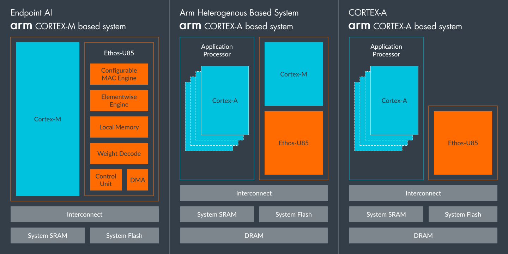
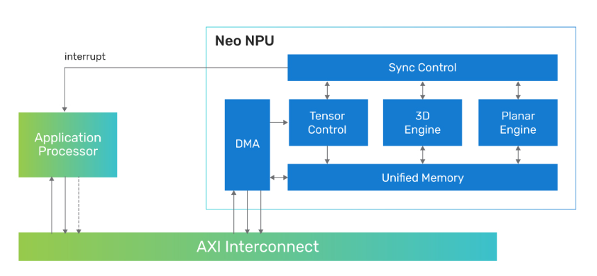
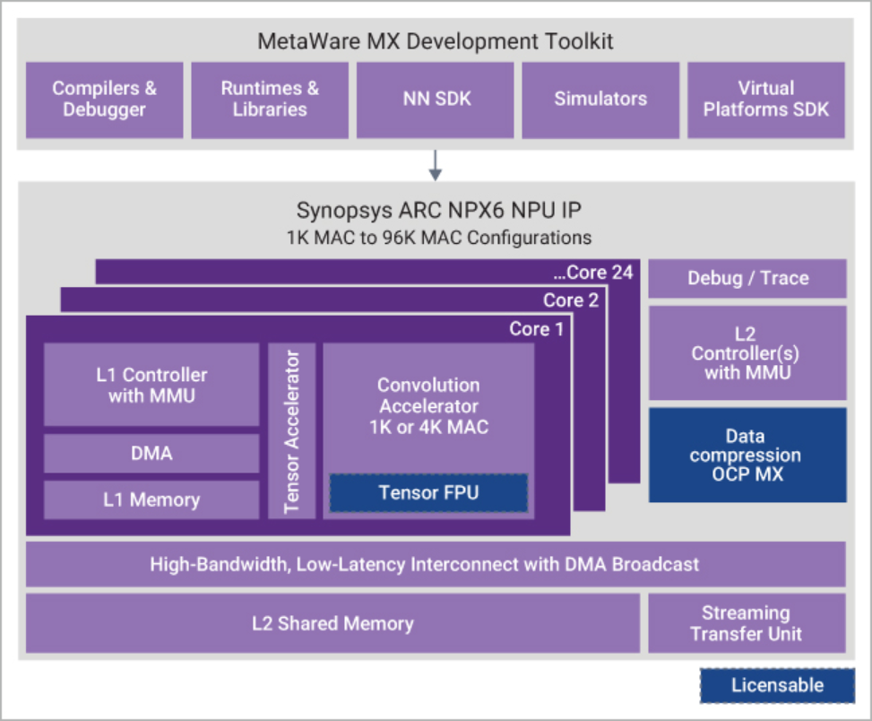
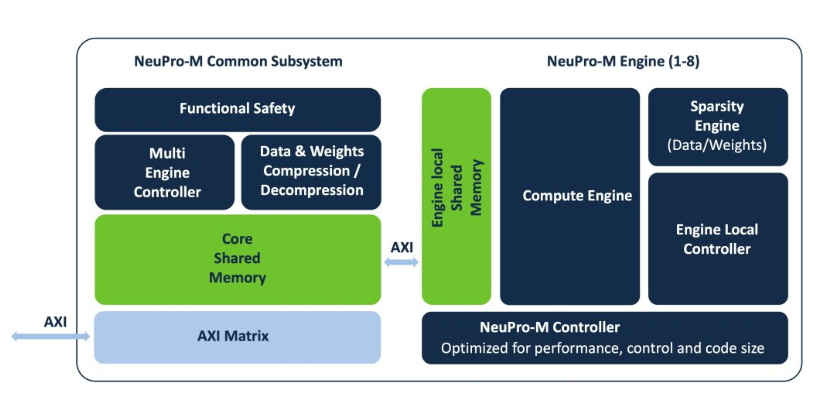
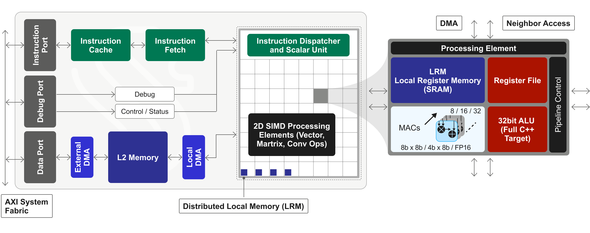
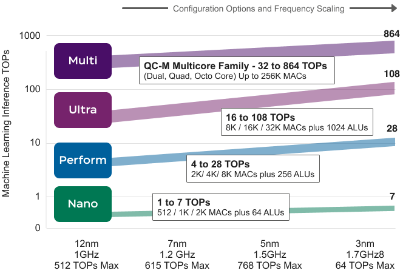

# Silicon IP

 Here's a breakdown of the latest architectural strategies, capabilities, and performance metrics across the vendors you mentioned—tailored to your hardware-aware lens:

---

## 🧠 AI Silicon IP Landscape: Architecture \& Performance

### 🔹 **Cadence (Neo NPUs + Tensilica IP)**

- **Architecture**: Neo NPUs are scalable from 8 GOPS to 80 TOPS per core, with multicore configurations reaching hundreds of TOPS. They use AMBA AXI interconnects for host offload and support both classic and generative AI models.

- **Software Stack**: NeuroWeave SDK offers unified tooling across Cadence and Tensilica IPs, enabling no-code AI development and tight integration with Cadence’s EDA flows.

- **Use Cases**: Optimized for edge AI—hearables, wearables, mobile vision, AR/VR, ADAS—with strong PPA (power, performance, area) characteristics.

### 🔹 **Synopsys (ARC NPX NPUs + ARC-V CPUs)**

- **Architecture**: ARC NPX NPUs scale from 1 to 400+ TOPS, with built-in DSPs and smart sensors for energy monitoring. ARC-V CPUs offer power-saving cores with AI acceleration.

- **IP Portfolio**: Includes interface IP, embedded memories, logic libraries, and security blocks (PUF, TRNG, crypto), all silicon-proven and standards-compliant.

- **Edge Focus**: Strong emphasis on low-power, secure edge AI with customizable memory and connectivity IP.

### 🔹 **Arm (Artisan IP + Ethos NPUs)**

- **Architecture**: Ethos-U and Ethos-N series NPUs target microcontroller-class and application-class devices respectively. They use tightly coupled memory and efficient MAC pipelines.

- **Recent Moves**: Cadence acquired Arm’s Artisan Foundation IP (standard cells, memory compilers, GPIOs), deepening its control over foundational PPA optimization.

- **Integration**: Arm’s IP is often embedded in SoCs with Cortex-A/M cores, enabling unified CPU-NPU pipelines.

### 🔹 **CEVA (XM6, NeuPro-M Series)**

- **Architecture**: CEVA’s NeuPro-M NPUs offer modular AI cores with up to 20 TOPS, supporting mixed precision and sparse computation. XM6 targets vision AI with SIMD and VLIW enhancements.

- **Software**: CEVA-Toolbox and Deep Neural Network Compiler enable model optimization and deployment across CEVA cores.

- **Specialization**: Strong in audio, vision, and sensor fusion—ideal for wearables, automotive, and smart cameras.

### 🔹 **Quadric (qNPU Architecture)**

- **Architecture**: Quadric’s qNPU blends CPU-like programmability with NPU-like parallelism. It uses a unified memory model and supports dynamic workloads (e.g., control + inference).

- **Performance**: Targets mid-range edge devices with 1–10 TOPS, focusing on real-time decision-making and low-latency execution.

- **Differentiator**: Unlike fixed-function NPUs, qNPU supports branching and control flow, making it suitable for hybrid workloads.

---

## 🧩 Comparative Summary

| Vendor     | Peak TOPS/Core | Architecture Focus         | Software Stack         | Edge AI Strengths                  |
|------------|----------------|-----------------------------|------------------------|------------------------------------|
| Cadence    | 80 (Neo NPU)   | Scalable NPU + Tensilica IP | NeuroWeave SDK         | High PPA, broad edge coverage      |
| Synopsys   | 400+ (ARC NPX) | NPU + CPU + security IP     | ARC MetaWare + modeling tools | Secure, low-power edge AI         |
| Arm        | ~10–100        | Ethos NPUs + Artisan IP     | CMSIS-NN, Arm NN SDK   | Tight CPU-NPU integration          |
| CEVA       | ~20            | Modular NPU + vision DSP    | CEVA Toolbox           | Audio/vision/sensor fusion         |
| Quadric    | ~10            | Programmable qNPU           | Quadric SDK            | Hybrid control + inference         |

---

# Data Movement Management and Control

Let’s dissect the architectural underpinnings of each vendor’s AI IP through the lens of memory movement, operand scheduling, and tiling strategies—especially as they relate to large-scale matrix operations and edge inference workloads.

---

## 🧠 Deep Dive: Memory Movement, Operand Scheduling \& Tiling Strategies

### 🔹 **Cadence (Neo NPUs + Tensilica DSPs)**

- **Memory Movement**:

  - Neo NPUs use tightly coupled SRAM blocks and DMA engines to stream operands into MAC arrays.

  - Tensilica DSPs support configurable memory hierarchies, enabling local scratchpad tiling and burst transfers from external DRAM.

  - Cadence’s NeuroWeave SDK models memory movement explicitly, allowing prefetching and double-buffering for latency hiding.

- **Operand Scheduling**:

  - Neo NPUs implement result-stationary scheduling for convolutions and matrix ops, minimizing write-back bandwidth.

  - Operand injection is pipelined across stages, with loop unrolling and SIMD vectorization applied at compile time.

- **Tiling Strategy**:

  - Supports hierarchical tiling: L1 scratchpad tiles → L2 SRAM tiles → DRAM tiles.

  - Loop nest generation tools emit annotated schedules for matmul, LU, and QR, with configurable tile sizes based on PPA constraints.

---

### 🔹 **Synopsys (ARC NPX NPUs + ARC-V CPUs)**

- **Memory Movement**:

  - ARC NPX NPUs use configurable memory ports and smart DMA controllers to stream data from external memory into compute clusters.

  - Foundation IP includes optimized SRAM and NVM blocks for operand staging and persistent weights.

- **Operand Scheduling**:

  - NPUs support weight-stationary and output-stationary modes depending on workload.

  - Scheduling is guided by ARC MetaWare tools, which model buffer occupancy and credit-based flow control.

- **Tiling Strategy**:

  - Loop nests are synthesized with tiling parameters that match the NPU’s MAC array dimensions.

  - For CNNs, tiles are aligned with filter sizes and stride patterns; for matmul, rectangular tiling is used to match operand aspect ratios.

---

### 🔹 **Arm (Ethos-U/N Series)**

- **Memory Movement**:

  - Ethos NPUs use tightly coupled memory (TCM) and shared L2 caches with Cortex cores.

  - Memory movement is orchestrated via CMSIS-NN and Arm NN SDK, which optimize tensor layout and reuse.

- **Operand Scheduling**:

  - Ethos-U uses input-stationary scheduling for low-power MCUs; Ethos-N supports mixed scheduling modes for higher throughput.

  - Scheduling is fused with quantization-aware compilation to reduce memory footprint.

- **Tiling Strategy**:

  - Tiles are shaped to fit within TCM and cache lines, with loop nests generated to minimize DRAM access.

  - For matmul, tiling is often fused with activation functions to reduce intermediate storage.

---

### 🔹 **CEVA (NeuPro-M + XM6 DSPs)**

- **Memory Movement**:

  - CEVA’s IP uses shared memory banks and configurable DMA engines for operand streaming.

  - Smart memory hierarchies allow simultaneous access to weights, activations, and intermediate results.

- **Operand Scheduling**:

  - NeuPro-M supports sparse operand scheduling and mixed precision injection.

  - XM6 DSPs use VLIW and SIMD scheduling for vision workloads, with loop fusion to reduce memory traffic.

- **Tiling Strategy**:

  - Tiles are shaped to match vector register widths and DSP pipeline depth.

  - For matrix ops, CEVA’s compiler emits loop nests with fused tiling and padding to handle non-square matrices.

---

### 🔹 **Quadric (qNPU Architecture)**

- **Memory Movement**:

  - qNPU uses a unified memory model—no explicit scratchpad—which simplifies operand movement but requires careful cache-aware tiling.

  - Operands are streamed via load/store instructions, with compiler-inserted prefetch hints.

- **Operand Scheduling**:

  - Unlike fixed NPUs, qNPU supports branching and control flow, enabling dynamic operand scheduling.

  - Loop nests are compiled into control+compute blocks, with operand reuse modeled via SSA (static single assignment).

- **Tiling Strategy**:

  - Tiling is dynamic and programmable—tiles can be reshaped at runtime based on workload.

  - For matmul, tiling is guided by loop-carried dependencies and cache reuse metrics.

---

## 🧩 Comparative Summary

| Vendor     | Memory Movement Model         | Operand Scheduling Style         | Tiling Strategy Focus                     |
|------------|-------------------------------|----------------------------------|-------------------------------------------|
| Cadence    | DMA + scratchpad + SRAM       | Result-stationary, SIMD          | Hierarchical tiling, annotated loop nests |
| Synopsys   | Smart DMA + SRAM/NVM          | Weight/output-stationary         | Aspect-ratio aware tiling                 |
| Arm        | TCM + cache + CMSIS-NN        | Input-stationary, quant-aware    | Cache-line aligned tiling                 |
| CEVA       | Shared banks + DMA            | Sparse, SIMD/VLIW                | Vector-width and padding-aware tiling     |
| Quadric    | Unified memory + prefetch     | Dynamic, control+compute fusion  | Runtime reshaping, SSA-guided tiling      |

---

# Concurrency Models

In the following, we have representative loop nest templates and concurrency models for each vendor’s AI IP, focusing on matrix operations like matmul, LU, and QR. These are abstracted but grounded in architectural traits and operand delivery semantics.

---

## 🧵 Loop Nest Templates (Representative)

Each template reflects tiling, operand injection, and scheduling style. I’ll annotate memory movement and loop-carried dependencies.

### 🔹 **Cadence Neo NPU (Result-Stationary)**

```c
for (i_outer = 0; i_outer < M; i_outer += Ti) {
  for (j_outer = 0; j_outer < N; j_outer += Tj) {
    preload_C_tile(i_outer, j_outer); // Result-stationary
    for (k_outer = 0; k_outer < K; k_outer += Tk) {
      stream_A_tile(i_outer, k_outer); // Operand streaming
      stream_B_tile(k_outer, j_outer);
      for (ii = 0; ii < Ti; ii++) {
        for (jj = 0; jj < Tj; jj++) {
          for (kk = 0; kk < Tk; kk++) {
            C[ii][jj] += A[ii][kk] * B[kk][jj]; // MAC pipeline
          }
        }
      }
    }
    write_back_C_tile(i_outer, j_outer);
  }
}
```

### 🔹 **Synopsys ARC NPX (Weight-Stationary)**

```c
for (k_outer = 0; k_outer < K; k_outer += Tk) {
  preload_B_tile(k_outer); // Stationary weights
  for (i_outer = 0; i_outer < M; i_outer += Ti) {
    stream_A_tile(i_outer, k_outer);
    for (j_outer = 0; j_outer < N; j_outer += Tj) {
      allocate_C_tile(i_outer, j_outer);
      for (ii = 0; ii < Ti; ii++) {
        for (jj = 0; jj < Tj; jj++) {
          for (kk = 0; kk < Tk; kk++) {
            C[ii][jj] += A[ii][kk] * B[kk][jj];
          }
        }
      }
      write_back_C_tile(i_outer, j_outer);
    }
  }
}
```

### 🔹 **Arm Ethos-N (Input-Stationary)**

```c
for (i_outer = 0; i_outer < M; i_outer += Ti) {
  preload_A_tile(i_outer); // Stationary input
  for (k_outer = 0; k_outer < K; k_outer += Tk) {
    stream_B_tile(k_outer);
    for (j_outer = 0; j_outer < N; j_outer += Tj) {
      allocate_C_tile(i_outer, j_outer);
      for (ii = 0; ii < Ti; ii++) {
        for (jj = 0; jj < Tj; jj++) {
          for (kk = 0; kk < Tk; kk++) {
            C[ii][jj] += A[ii][kk] * B[kk][jj];
          }
        }
      }
      write_back_C_tile(i_outer, j_outer);
    }
  }
}
```

### 🔹 **CEVA NeuPro-M (Sparse + SIMD)**

```c
for (i_outer = 0; i_outer < M; i_outer += Ti) {
  for (j_outer = 0; j_outer < N; j_outer += Tj) {
    preload_sparse_C_tile(i_outer, j_outer);
    for (k_outer = 0; k_outer < K; k_outer += Tk) {
      stream_sparse_A_tile(i_outer, k_outer);
      stream_sparse_B_tile(k_outer, j_outer);
      simd_mac(C_tile, A_tile, B_tile); // SIMD fused
    }
    write_back_C_tile(i_outer, j_outer);
  }
}
```

### 🔹 **Quadric qNPU (Control + Compute Fusion)**

```c
for (i = 0; i < M; i++) {
  for (j = 0; j < N; j++) {
    C[i][j] = 0;
    for (k = 0; k < K; k++) {
      if (predicate(i, j, k)) { // Control flow
        C[i][j] += A[i][k] * B[k][j];
      }
    }
  }
}
```

---

## 📊 Gantt-Style Concurrency Models

These models show operand injection, compute phases, and write-back latency. Each row is a pipeline stage; each column is a time slice.

### 🔹 **Cadence Neo NPU**

```
Time →      T0   T1   T2   T3   T4   T5   T6
------------------------------------------------
A_stream     ▓▓▓  ▓▓▓
B_stream          ▓▓▓  ▓▓▓
MAC_compute            ███  ███  ███
C_writeback                     ░░░
```

- **Overlap**: A and B streamed in staggered fashion.
- **Compute**: Result-stationary MACs dominate mid-phase.
- **Write-back**: Deferred until all tiles complete.

### 🔹 **Synopsys ARC NPX**

```
Time →      T0   T1   T2   T3   T4
-------------------------------------
B_preload    ▓▓▓
A_stream          ▓▓▓
MAC_compute            ███  ███
C_writeback                 ░░░
```

- **Weight-stationary**: B loaded once, reused.
- **Compute**: Loop nests fused with operand reuse.
- **Latency**: Lower due to reduced memory traffic.

### 🔹 **Arm Ethos-N**

```
Time →      T0   T1   T2   T3
-------------------------------
A_preload    ▓▓▓
B_stream          ▓▓▓
MAC_compute            ███
C_writeback               ░░░
```

- **Input-stationary**: A reused across tiles.
- **Compact**: Ideal for low-power MCUs.

### 🔹 **CEVA NeuPro-M**

```
Time →      T0   T1   T2   T3   T4
-------------------------------------
Sparse_A     ▓▓
Sparse_B          ▓▓
SIMD_MAC               ███
C_writeback                ░░░
```

- **Sparse-aware**: Operand injection is conditional.
- **SIMD**: High throughput, low latency.

### 🔹 **Quadric qNPU**

```
Time →      T0   T1   T2   T3   T4   T5
-----------------------------------------
Load_A       ▓
Load_B            ▓
Branch_eval            ▒▒
MAC_compute                 ███
C_writeback                     ░░░
```

- **Control flow**: Branching adds latency.
- **Unified memory**: No explicit staging.

---

# Operand Reuse Comparison

Thanks for the vote of cautious confidence, Theodore. Let’s get surgical with this. I’ll synthesize buffer occupancy models and operand reuse across loop levels for each vendor’s AI IP, focusing on matrix operations like matmul and LU/QR decomposition. These models are abstracted but grounded in architectural traits and scheduling semantics.

---

## 📦 Buffer Occupancy Models

These models track buffer usage across loop levels and pipeline stages. I’ll annotate read/write pressure, reuse windows, and flow control implications.

### 🔹 **Cadence Neo NPU (Result-Stationary)**

| Buffer Type     | Loop Level | Occupancy Pattern         | Notes                                 |
|------------------|------------|----------------------------|----------------------------------------|
| A_tile_buffer    | `k_outer`  | High burst, short-lived    | Streamed per tile; reused across `ii` |
| B_tile_buffer    | `k_outer`  | High burst, short-lived    | Streamed per tile; reused across `jj` |
| C_tile_buffer    | `i_outer,j_outer` | Persistent, accumulative | Result-stationary; reused across `kk` |
| DMA FIFO         | `k_outer`  | Cyclic fill/drain          | Double-buffered for latency hiding     |

- **Flow Control**: Credit-based injection throttles A/B tiles if C buffer is near saturation.
- **Reuse Window**: C buffer reuse spans full `kk` loop; A/B reuse is intra-tile only.

---

### 🔹 **Synopsys ARC NPX (Weight-Stationary)**

| Buffer Type     | Loop Level | Occupancy Pattern         | Notes                                 |
|------------------|------------|----------------------------|----------------------------------------|
| B_tile_buffer    | `k_outer`  | Persistent across tiles    | Weight-stationary; reused across `ii,jj` |
| A_tile_buffer    | `i_outer`  | Cyclic burst               | Streamed per tile                      |
| C_tile_buffer    | `i_outer,j_outer` | Accumulative            | Written after full `kk` traversal      |
| Prefetch Queue   | `k_outer`  | Staggered fill             | Prefetches next B tile during compute  |

- **Flow Control**: B buffer occupancy drives scheduling; A tiles injected only when B is stable.
- **Reuse Window**: B buffer reuse spans entire outer loop nest.

---

### 🔹 **Arm Ethos-N (Input-Stationary)**

| Buffer Type     | Loop Level | Occupancy Pattern         | Notes                                 |
|------------------|------------|----------------------------|----------------------------------------|
| A_tile_buffer    | `i_outer`  | Persistent across tiles    | Input-stationary; reused across `kk,jj` |
| B_tile_buffer    | `k_outer`  | Cyclic burst               | Streamed per tile                      |
| C_tile_buffer    | `i_outer,j_outer` | Accumulative            | Written after full `kk` traversal      |
| TCM Cache        | All levels | Cache-line aligned         | Reuse depends on layout and stride     |

- **Flow Control**: TCM occupancy governs tile size; compiler fuses loops to maximize reuse.
- **Reuse Window**: A buffer reused across full inner loop nest.

---

### 🔹 **CEVA NeuPro-M (Sparse + SIMD)**

| Buffer Type     | Loop Level | Occupancy Pattern         | Notes                                 |
|------------------|------------|----------------------------|----------------------------------------|
| Sparse_A_buffer  | `i_outer,k_outer` | Conditional burst       | Only non-zero entries injected         |
| Sparse_B_buffer  | `k_outer,j_outer` | Conditional burst       | SIMD lanes filled sparsely             |
| C_tile_buffer    | `i_outer,j_outer` | Accumulative            | SIMD fused MACs                        |
| VLIW Register File | Inner loops | Fully occupied            | Loop fusion maximizes reuse            |

- **Flow Control**: Sparse injection throttled by non-zero density.
- **Reuse Window**: SIMD reuse across vector lanes; sparse buffers reused conditionally.

---

### 🔹 **Quadric qNPU (Unified Memory + Control Flow)**

| Buffer Type     | Loop Level | Occupancy Pattern         | Notes                                 |
|------------------|------------|----------------------------|----------------------------------------|
| A_tile_cache     | `i,k`      | Cache-aware burst          | No explicit staging; compiler-managed  |
| B_tile_cache     | `k,j`      | Cache-aware burst          | Prefetch hints inserted                |
| C_tile_cache     | `i,j`      | Accumulative               | SSA-based reuse                        |
| Branch Eval Buff | `i,j,k`    | Conditional occupancy      | Control flow determines injection      |

- **Flow Control**: Compiler inserts branch guards; occupancy varies dynamically.
- **Reuse Window**: Operand reuse modeled via SSA and loop-carried dependencies.

---

## 🔁 Operand Reuse Across Loop Levels

Here’s a comparative view of reuse patterns:

| Vendor     | Operand Reuse Strategy         | Loop Levels Reused Across         | Notes                                 |
|------------|-------------------------------|-----------------------------------|----------------------------------------|
| Cadence    | Result-stationary             | `kk`                              | C reused across inner loop            |
| Synopsys   | Weight-stationary             | `ii`, `jj`                        | B reused across outer loops           |
| Arm        | Input-stationary              | `kk`, `jj`                        | A reused across inner loops           |
| CEVA       | Sparse + SIMD                 | SIMD lanes, conditional reuse     | Reuse depends on sparsity             |
| Quadric    | SSA + control flow            | Dynamic, compiler-managed         | Reuse inferred from control paths     |

---

# Architecture Diagrams

Architecture diagrams for each of the AI silicon IPs to compare structural layouts, data paths, and compute hierarchies across vendors.

### **Arm Ethos-N/U Series**

The Arm Ethos-U85 is the highest performance implementation of the Arm Ethos-U NPU. It enables enhanced edge AI processing with support for transformer-based models and delivers 20% more energy efficiency than previous generations of Ethos. The key characteristics of Ethos-U85 include:

- Highlights: Tightly coupled memory, quantization-aware pipelines, Cortex integration
- Scalable performance – 256 GOP/s up to 4 TOPs at 1 GHz
  - Scales from 128 to 2048 MACs
- Further reduced energy consumption – 20% lower than previous Ethos-U NPUs
- Native support for transformer-based networks

Ethos-U85 targets numerous different applications with use in high-performance Arm Cortex-A or low-power embedded devices based on Arm Cortex-M.



- Vendor marketing materials for the [Arm Ethos-U85 architecture](https://www.arm.com/products/silicon-ip-cpu/ethos/ethos-u85)

### **Cadence Neo NPU**
- Highlights: Scalable MAC arrays, DMA engines, NeuroWeave SDK integration

The Cadence Neo NPUs offer energy-efficient hardware-based AI engines that can be paired with any host processor for offloading artificial intelligence and machine learning (AI/ML) processing. The Neo NPUs target a wide variety of applications, including sensor, audio, voice/speech, vision, radar, and more. The comprehensive performance range makes the Neo NPUs well-suited for ultra-power-sensitive applications such as IoT, hearables/wearables, high-performance systems in AR/VR, automotive, and more.

The product architecture natively supports the processing required for many network topologies and operators, allowing for a complete or near-complete offload from the host processor. Depending on the application’s needs, the host processor can be an application processor, a general-purpose MCU, or a DSP for pre-/post-processing and associated signal processing, with the inferencing managed by the NPU.

The Neo NPUs provide performance scalability from 256 up to 32k 8x8-bit MAC per cycle with a single core, suiting an extensive range of processing needs. Capacity configurations are available in power-2 increments, allowing for the right sizing in an SoC for the target applications. Int4, Int8, Int16, and FP16 are all natively supported data types, with mixed precision supported by the hardware and associated software tools, allowing for the best performance and accuracy tradeoffs.

Additional features of the Neo NPUs include compression/decompression to minimize system memory space and bandwidth consumption for a network and energy-optimized compute hardware to leverage network sparsity tradeoffs.

The Neo NPUs support typical clock frequencies of up to 1.25GHz in 7nm, and customers can target lower clock frequencies for specific product needs.



- Vendor marketing materials for the [Cadence Neo NPU architecture](https://www.cadence.com/en_US/home/tools/silicon-solutions/ai-ip-platform/neo-npu.html)

### **Synopsys ARC NPX NPU**
- Highlights: Modular compute clusters, smart DMA, ARC-V CPU integration

Synopsys ARC® NPX Neural Processor IP family provides a high-performance, power- and area-efficient IP solution for a range of applications requiring AI-enabled SoCs. The ARC NPX6 NPU IP is designed for deep learning algorithm coverage including both computer vision tasks such as object detection, image quality improvement, and scene segmentation, and for broader AI applications, including generative AI.

The NPX6 NPU family offers multiple products to choose from to meet your specific application requirements. The architecture is based on individual cores that can scale from 1K MACs to 96K MACs for a single AI engine performance of over 250 TOPS and over 440 TOPS with sparsity. The NPX6 NPU IP includes hardware and software support for multi-NPU clusters of up to 8 NPUs achieving 3500 TOPS with sparsity. Advanced bandwidth features in hardware and software, and a memory hierarchy (including L1 memory in each core and a high-performance, low-latency interconnect to access a shared L2 memory) make scaling to a high MAC count possible. An optional tensor floating point unit is available for applications benefiting from BF16 or FP16 inside the neural network. An optional data compression is also available using microscaling formats (OCP MX data types) which reduces memory footprint and bandwidth pressures for large models.

To speed application software development, the ARC NPX6 NPU Processor IP is supported by the MetaWare MX Development Toolkit, a comprehensive software programming environment that includes a neural network Software Development Kit (NN SDK) and support for virtual models. The NN SDK automatically converts neural networks trained using popular frameworks, like Pytorch, Tensorflow, or ONNX into optimized executable code for the NPX hardware.

The NPX6 NPU Processor IP can be used to create a range of products – from a few TOPS to 1000s of TOPS – that can be programmed with a single toolchain.



- Vendor marketing materials for the [Synopsys ARC NPX6 architecture](https://www.synopsys.com/dw/ipdir.php?ds=arc-npx6)


### **CEVA NeuPro-M**
- Highlights: Heterogeneous compute blocks, SIMD/VLIW cores, secure execution zones

The Ceva-NeuPro-M NPU IP family is a highly scalable, complete hardware and software IP solution for embedding high performance AI processing in SoCs across a wide range of edge and cloud AI applications.

The heart of the NeuPro-M NPU architecture is the computational unit. Scalable from 2 to 32 TOPs, a single computational unit comprises a multiple-MAC parallel neural computing engine, activation and sparsity control units, an independent programable vector-processing unit, plus local shared L1 memory and a local unit controller. A core may contain up to eight of these computational units, along with a shared Common Subsystem comprising functional-safety, data-compression, shared L2 memory, and system interfaces.

These NPU cores may be grouped into multi-core clusters to reach performance levels of thousands of TOPs.

| NeuPro-M Core | 4x4 MACs (optional) | 8x8 MACs | 16x16 MACs | FP16 MACs (Optional) | # of Engines |
|:--------------| :-------------------| :--------| :----------| :--------------------| :------------|
| NPM2K | 8K | 1K | 512 | 1k | 1 |
| NPM4K | 16k | 4K | 1K | 2K | 1 |
| NPM8K | 32K | 8K | 2K | 4K | 1 |
| NPM16K | 64K | 16K | 4K | 8K | 2 |
| NPM32K | 128K | 8K | 8K | 16K | 4 |
| NPM64K | 256K | 16K | 16K | 32K | 8 |



The Ceva-NeuPro-M NPU family empowers edge AI and cloud inference system developers with the computing power and energy efficiency needed to implement complex AI workloads. It enables deployment of multi-modal models and transformers in edge AI SoCs, delivering scalable performance for real-time, on-device processing with enhanced flexibility and efficiency and to cloud inference data bases.

The family can scale from smaller systems, for such applications as security cameras, robotics, or IoT devices, with performance starting at 2 TOPS, to thousands of TOPs of multi-core systems capable of LLM and multi-modal generative AI, all using the same hardware units, core structure, and AI software stack.

NeuPro-M provides direct hardware support for vital model optimizations, including variable precision for weights and hardware-supported addressing of sparse arrays. An independent vector processor on each computational unit supports novel computations that might be required in future AI algorithms. 

The IP also provides hardware support for functional safety ISO 26262 ASIL-B.

- [View CEVA NeuPro-M architecture](https://www.ceva-ip.com/product/ceva-neupro-m/)

### **Quadric qNPU (Chimera GPNPU)**
- Highlights: Unified memory model, control+compute fusion, real-time DSP integration

The Quadric processor architecture is optimized for on-device artificial intelligence computing. The Quadric Chimera GPNPU delivers high AI inference performance and also runs complex C++ code without forcing the developer to artificially partition code between two or three different kinds of processors.

Quadric’s Chimera GPNPU is a licensable processor that scales from 1 to 864 TOPS. Chimera GPNPUs run all AI models - including classical backbones, vision transformers, and state-of-the-art large language models.

Designed from the ground up to address the constantly evolving AI inference deployment challenges facing system on chip (SoC) developers, Quadric's Chimera(TM) general purpose neural processor (GPNPU) family has a simple yet powerful architecture with demonstrated improved matrix-computation performance over the traditional approach. Its crucial differentiation is its ability to execute diverse workloads with great flexibility all in a single processor.

The Chimera GPNPU family provides a unified processor architecture that handles matrix, vector and scalar (control) code in one execution pipeline. In competing NPU alternatives AI workloads are traditionally by a combination of NPU "accelerator" paired with one or both of a legacy DSP or realtime CPU, requiring splitting AI/ML graph execution and tuning performance across two or three heterogenous cores. The Chimera GPNPU is a single software-controlled core, allowing for simple expression of complex parallel workloads.

The Chimera GPNPU is entirely driven by code, empowering developers to continuously optimize the performance of their models and algorithms throughout the device’s lifecycle. That's why it's ideal to run classic backbone networks, todays' newest Transformers and Large Language Models, and whatever new networks are invented tomorrow.



##### Key Architectural Features
- Hybrid Von Neuman + 2D SIMD matrix architecture
- 64b Instruction word, single instruction issue per clock
- 7-stage, in-order pipeline
- Scalar / vector / matrix instructions modelessly intermixed with granular predication
- Deterministic, non-speculative execution delivers predictable performance levels
- Configurable AXI Interfaces to system memory (independent data and instruction access)
- Configurable Instruction cache (64/128/256K)
- Distributed tightly coupled local register memories (LRM) with data broadcast networks within the matrix array allows overlapped compute and data movement to maximize performance
- Local L2 data memory (multi-bank, configurable 1MB to 16MB) minimizes off-chip DDR access, lowering power dissipation
- Optimized for INT8 machine learning inference (with optional FP16 floating point MAC support, and A8W4 MAC option) plus 32b ALU DSP ops for full C++ compiler support
- Compiler-driven, fine-grained clock gating delivers power savings



The Chimera QC processor family spans a wide range of performance requirements. As a fully synthesizable processor, you can implement a Chimera IP core in any process technology, from older nodes to the most advanced technologies.  From the single-core QC Nano all the way to 8-way QC-Multi clusters, there is a Chimera processor that meets your performance goals. 

##### Benefits

Quadric’s solution enables hardware developers to instantiate a single core that can handle an entire AI/ML workload plus the typical digital signal processor functions and signal conditioning workloads often intermixed with inference functions. Dealing with a single core drastically simplifies hardware integration and eases performance optimization. System design tasks such as profiling memory usage and estimating system power consumption are greatly simplified.
Programming Simplicity
Quadric’s Chimera GPNPU architecture dramatically simplifies software development since matrix, vector, and control code can all be handled in a single code stream. Graph code from the common training toolsets (Tensorflow, Pytorch, ONNX formats) is compiled by the Quadric SDK and can be merged with signal processing code written in C++, all compiled into a single code stream running on a single processor core.

Quadric’s SDK meets the demands of both hardware and software developers, who no longer need to master multiple toolsets from multiple vendors. The entire subsystem can be debugged in a single debug console. This can dramatically reduce code development time and ease performance optimization.

This new programming paradigm also benefits the end users of the SoCs since they will have access to program all the GPNPU resources.

- Vendor marketing material for the [Quadric Chimera architecture](https://www.cnx-software.com/2022/11/02/quadric-chimera-gpnpu-ip-combines-npu-dsp-and-real-time-cpu-into-one-single-programmable-core/)

---


