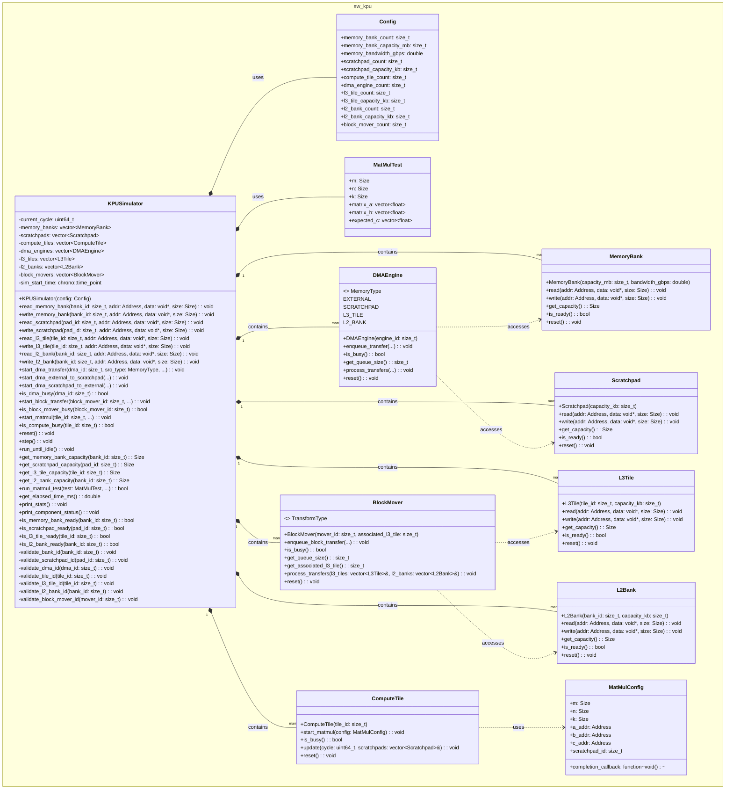

# UML Diagram of simulator

The UML diagram shows the KPUSimulator class architecture with its key characteristics:

**Main Components:**

- **KPUSimulator** - The central orchestrator class that manages all hardware components

- **Memory hierarchy** - MemoryBank (external), L3Tile, L2Bank, and Scratchpad

- **Data movement engines** - DMAEngine (memory↔scratchpad) and BlockMover (L3↔L2)

- **Compute resources** - ComputeTile for matrix multiplications

**Key Design Patterns:**

- **Composition** - KPUSimulator contains vectors of all component types

- **Delegation** - Clean API that delegates operations to appropriate components

- **Configuration-driven** - Constructor takes a Config object to set up all resources

- **Callback-based async operations** - DMA transfers and compute operations use callbacks

**Notable C++ idioms used:**

- RAII through proper constructor initialization with `reserve()` and `emplace_back()`

- Exception safety with validation methods throwing `std::out_of_range`

- Move semantics for callbacks (`std::move(callback)`)

- Modern range-based loops in `step()` and status checking

- Proper const-correctness on query methods

The simulator provides both low-level component access and high-level test operations, making it suitable for both detailed hardware modeling and system-level validation.

